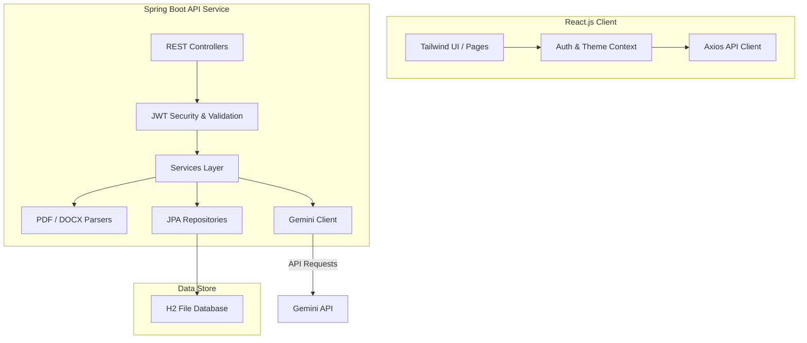
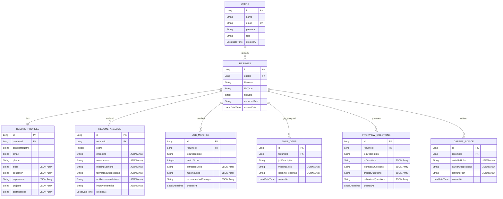

# ResumeIQ – AI-Powered Resume Analyzer

ResumeIQ is a production-ready, full-stack web application designed to help job seekers optimize their resumes for Applicant Tracking Systems (ATS) and target job listings. Powered by Gemini AI (LLM) and Spring Boot, the platform extracts resume contents, compiles structured profiles, calculates keyword match percentages against job descriptions, identifies skill gaps, advises on suitable roles, and generates personalized mock interview questions.

---

## Technical Architecture



---

## Key Features

1. **JWT-Based Authentication**: Secure registration, login, and profile tracking using BCrypt password hashing.
2. **Multi-Format Text Extraction**: Instantly parses PDF (using Apache PDFBox) and DOCX (using Apache POI) uploads up to 5MB.
3. **Structured Resume Profile**: Automates parsing of raw resume contents into structured fields (Name, Email, Skills, Projects, Experience, Education) using Gemini.
4. **AI Resume Scorecard**: Grades formatting standards, content density, strengths, weaknesses, and suggests improvement tips.
5. **ATS Compliance Scan**: Grades layouts, keyword optimization, and completeness with category scoring meters.
6. **Target Job Matcher**: Pastes job descriptions to compare keywords, calculate match ratios, and find missing requirements.
7. **Mock Interview Generator**: Prepares HR, Technical, project-specific, and behavioral questions tailored to the resume and target job description.
8. **Career Advisor & Roadmaps**: Advises on job roles and maps month-by-month course timelines with topics and study resources.
9. **Analytics Dashboard**: Tracks score improvements over history trends and graphs skill distribution charts using Recharts.
10. **Dark / Light Mode**: Features visual transitions and customized scrollbars.

---

## Tech Stack

* **Frontend**: React.js, Tailwind CSS (v3), React Router, Axios, Recharts, Lucide Icons.
* **Backend**: Java Spring Boot, Spring Security (JWT), Spring Data JPA, Lombok, Jakarta Validation.
* **Database**: H2 File-based Database (stored in `./data/resumeiq`).
* **AI Engine**: Gemini AI (using `gemini-1.5-flash` model).
* **API Docs**: Swagger / OpenAPI v3.

---

## Database Design

All relational data is handled by Spring Data JPA. Serialization of collection elements (skills, strengths, learning plans) is conducted seamlessly across platforms using Jackson JPA attribute converters.



---

## API Documentation

When the backend application runs, the Swagger UI is publicly accessible for sandbox testing.

* **Swagger URL**: `http://localhost:8080/swagger-ui/index.html`
* **JSON API Docs**: `http://localhost:8080/v3/api-docs`

### Primary Endpoints

| Method | Endpoint | Description | Auth Required |
|:---|:---|:---|:---|
| `POST` | `/auth/register` | Register a new user | No |
| `POST` | `/auth/login` | Login user and retrieve JWT | No |
| `GET` | `/auth/profile` | Retrieve active profile details | Yes |
| `POST` | `/resume/upload` | Upload PDF/DOCX and parse profile | Yes |
| `GET` | `/resume/history` | Get list of user's uploaded resumes | Yes |
| `DELETE` | `/resume/{id}` | Delete uploaded resume and analyses | Yes |
| `GET` | `/resume/dashboard` | Compile dashboard metric summaries | Yes |
| `POST` | `/ai/analyze-resume` | Run AI scoring and scorecard reviews | Yes |
| `POST` | `/ai/ats-check` | Scan ATS layout and structure checks | Yes |
| `POST` | `/ai/job-match` | Compute match scores against Job Listings | Yes |
| `POST` | `/ai/interview-questions` | Generate mock interview questions | Yes |
| `POST` | `/ai/skill-gap` | Run priority-based skill gaps and courses | Yes |
| `POST` | `/ai/career-advice` | Generate career advisor job targets | Yes |

---

## Installation & Setup Guide

### Prerequisites
* Java JDK 21
* Node.js (v18 or higher) & npm

### Step 1: Configure Environment Variables
The backend utilizes the Gemini API and JWT security. Set the following environment variables before launching:

```bash
# Set Gemini API Key (Required for AI features)
export GEMINI_API_KEY="your-gemini-api-key-here"

# Set Custom JWT Secret (Optional - fallback defaults are configured)
export JWT_SECRET="your-secure-hexadecimal-secret"
```

*Note: On Windows, use `$env:GEMINI_API_KEY="your-key"` in PowerShell or `set GEMINI_API_KEY=your-key` in CMD.*

### Step 2: Launch Backend (Spring Boot)
Open a terminal in the `./backend` directory and execute the Maven Wrapper:

```bash
# Resolve and run using Maven Wrapper
./mvnw spring-boot:run
```

The server will start on `http://localhost:8080`.
The database file will be initialized automatically in `./backend/data/resumeiq.mv.db`. You can view the database console at `http://localhost:8080/h2-console` with JDBC URL `jdbc:h2:file:./data/resumeiq`, username `sa`, and password `password`.

### Step 3: Launch Frontend (React + Vite)
Open another terminal in the `./frontend` directory:

```bash
# Install dependencies
npm install

# Run dev server
npm run dev
```

The client will start on `http://localhost:5173`. Open it in your browser!

---

## Deployment Steps

### Backend Deployment (Render / Railway)
1. Push the code repository to GitHub.
2. In Render or Railway, create a new Web Service and link it to the github repository.
3. Configure the Root Directory to `backend` (if deploying in a monorepo structure).
4. Set the build command to `./mvnw clean package -DskipTests`.
5. Set the start command to `java -jar target/backend-0.0.1-SNAPSHOT.jar`.
6. Add the Environment Variables:
   - `GEMINI_API_KEY` = `your-api-key`
   - `JWT_SECRET` = `your-secure-secret`
7. Expose Port `8080`.

### Frontend Deployment (Vercel)
1. In Vercel, import your GitHub repository.
2. Configure the Root Directory to `frontend`.
3. Set the Framework Preset to `Vite`.
4. Add the Environment Variable `VITE_API_URL` pointing to your deployed backend URL.
5. Click Deploy!
